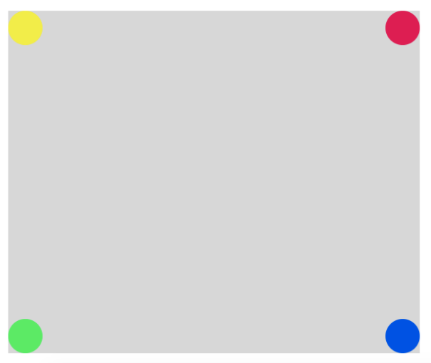
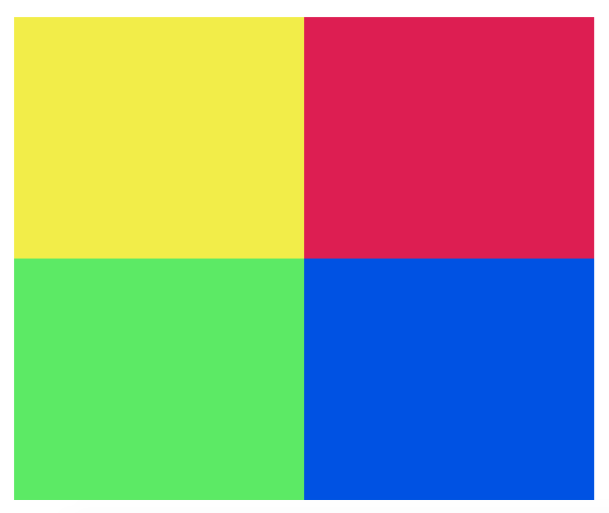
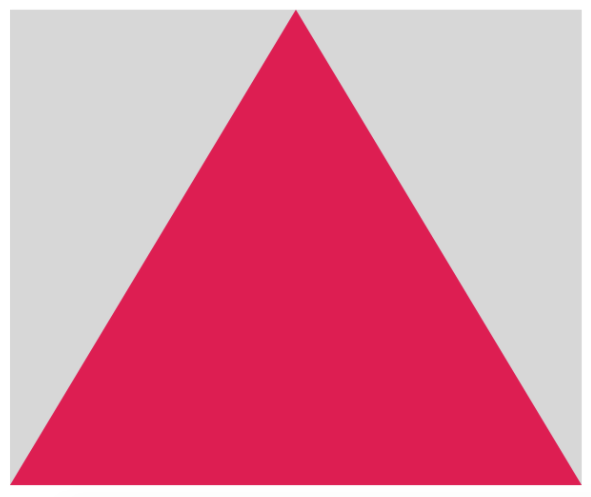
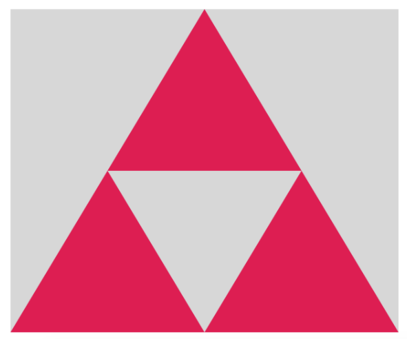
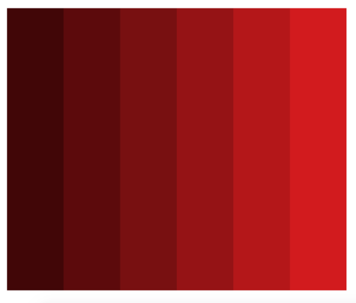
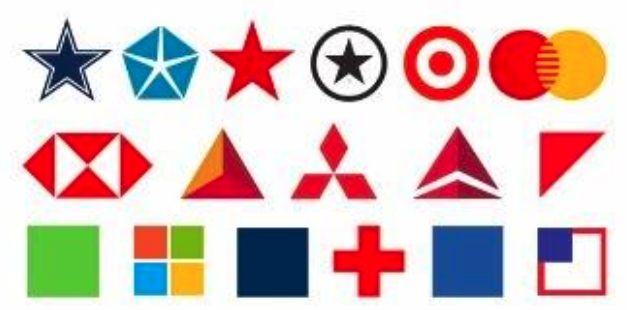

# p5.js Mockup Match

## The Goal

You've been given five digital works of art to recreate. Each one can be done using `fill()`, `ellipse()`, and other functions from the [p5.js documentation](https://p5js.org/reference/).

## Getting Started

This lab works best as a glitch project, or as a Repl.it project set to HTML/CSS. Ask an Upperline Code team member if you need help getting started.

## The Lab

Recreate each of the following images:

#### Challenge 1

#### Challenge 2

#### Challenge 3

#### Challenge 4

#### Challenge 5

#### Challenge 6

#### Challenge 7

